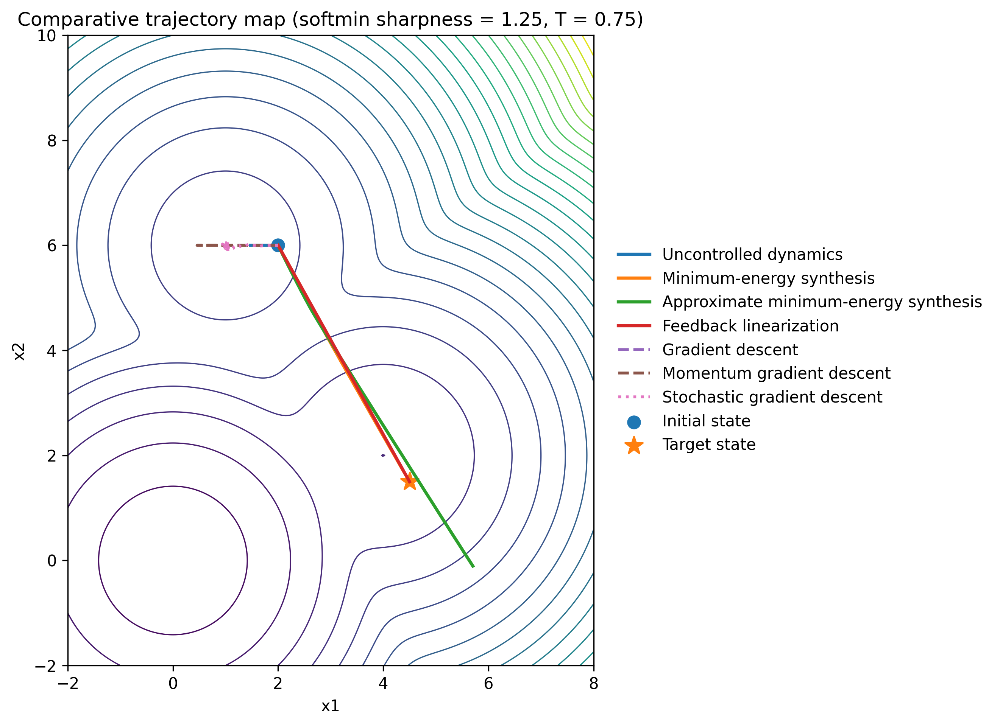

# Controlled Gradient Flow for ML Optimization

Research code for characterizing nonconvex optimization landscapes through **minimum-energy controlled gradient flow**.

The project treats gradient flow as a control-affine dynamical system,

```math
\dot{\theta}(t) = -\nabla L(\theta(t)) + u(t),
```

and asks how much control energy is required to steer an optimization trajectory between states and attraction basins. Steering energy becomes a geometric measure of directional difficulty, basin transitions, and local traversability.

## Highlights

- nonlinear and almost-Gramian minimum-energy steering;
- controlled vs. uncontrolled optimization comparisons;
- synthetic nonconvex and small neural-network loss experiments;
- directional energy maps and basin aggregation;
- parameter sweeps for soft-min landscapes;
- reproducible result artifacts separated from source code.

## Representative results

### Controlled trajectories



### Energy basin atlas


The atlas groups regions using directional steering cost rather than objective value or Euclidean distance alone.

## Repository structure

```text
.
├── controlled_gradient_flow/
│   ├── control_synthesis/   # Gramian / almost-Gramian steering
│   ├── core/                # objectives, dynamics, baselines, visualization
│   └── experiments/         # reproducible experiment entry points
├── baselines/               # standalone GD / momentum / SGD comparisons
├── results/
│   ├── data/                # finalized CSV/TXT experiment outputs
│   └── figures/             # energy maps, sweeps, diagnostics
├── requirements.txt
└── README.md
```

Generated checkpoints, partial outputs, caches, and temporary experiment state are intentionally excluded from version control.

## Setup

```bash
python -m venv .venv
source .venv/bin/activate   # Windows: .venv\Scripts\activate
pip install -r requirements.txt
```

## Example experiments

Run from the repository root:

```bash
python -m controlled_gradient_flow.experiments.run_single_case_comparison
python -m controlled_gradient_flow.experiments.run_softmin_sweep
python -m controlled_gradient_flow.experiments.run_energy_basin_detection
```

Standalone optimization baselines can be run with:

```bash
python baselines/quadratic_baselines.py
python baselines/softmin_baselines.py
```

## Research context

This repository contains the completed controlled-gradient-flow phase of research in the Ching Lab at Washington University in St. Louis. The broader research direction connects control-theoretic steering energy with optimization-landscape geometry.

Ongoing work extends nonlinear minimum-energy steering ideas toward state-to-state steering for sampling-based robotic motion planning; that unfinished work is intentionally kept separate from this completed study.

## Notes

The numerical experiments rely on JAX/Diffrax and can be computationally expensive. Long-running energy-atlas scripts support checkpointing locally, but checkpoint files and partial intermediate artifacts are not committed.


## Code organization

The public repository now uses the package name `controlled_gradient_flow` consistently. Historical prototype scripts, generated checkpoints, and partial-run artifacts are intentionally excluded so the repository emphasizes reusable methods and reproducible experiments rather than intermediate research state.
