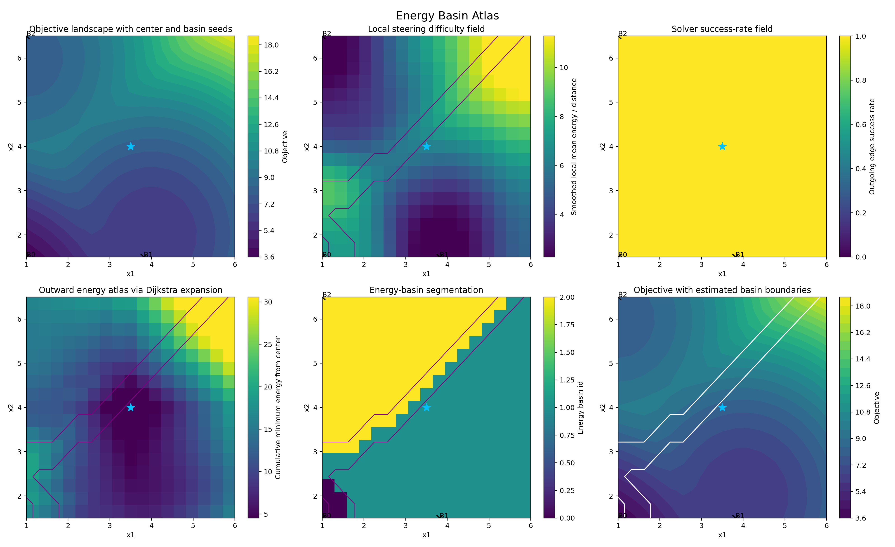

# Controlled Gradient Flow for ML Optimization

Research code for studying nonconvex optimization landscapes through **minimum-energy controlled gradient flow**.

This project treats gradient flow as a control-affine dynamical system,

```math
\dot{\theta}(t) = -\nabla L(\theta(t)) + u(t),
```

and asks how much control energy is required to steer optimization trajectories between states and attraction basins. The central idea is to use steering energy as a geometric measure of how difficult different directions and basin transitions are.

## What this repository contains

- **Controlled gradient-flow dynamics** for synthetic nonconvex objectives and small ML examples.
- **Gramian and nonlinear almost-Gramian steering** routines for approximate minimum-energy state transfer.
- **Baseline comparisons** against uncontrolled gradient descent, momentum, SGD, and feedback-linearizing control.
- **Energy-basin analysis** that aggregates local steering difficulty into larger regions of the landscape.
- **Parameter sweeps and visualization scripts** for comparing trajectories, energy-per-distance, and basin structure.

## Representative results

### Controlled vs. baseline trajectories


The experiments compare uncontrolled optimization trajectories with minimum-energy controlled transfers and standard optimization baselines on nonconvex objectives.

### Energy basin atlas



A representative 17 x 17 landscape sweep produces an energy-based partition into three basins. The basin atlas is constructed from directional steering costs rather than only objective values or Euclidean distance.

## Repository structure

```text
.
├── granmian_synthesis/
│   ├── control_synthesis/   # Gramian and almost-Gramian steering routines
│   ├── core/                # objectives, controlled dynamics, baselines
│   ├── experiments/         # experiment entry points
│   ├── data/                # generated summaries and basin-atlas outputs
│   └── plots/               # generated figures
└── uncontrolled_GD_comparison/
    └── ...                  # baseline gradient-descent studies
```

> Note: the historical package directory is named `granmian_synthesis`. It is retained for now to avoid breaking old experiment imports; the code itself implements Gramian-based synthesis.

## Setup

Python dependencies used by the research code are listed in `requirements.txt`.

```bash
python -m venv .venv
source .venv/bin/activate   # Windows: .venv\\Scripts\\activate
pip install -r requirements.txt
```

Most experiments are intended to be run from the repository root. For example:

```bash
python -m granmian_synthesis.experiments.run_single_case_comparison
python -m granmian_synthesis.experiments.run_energy_basin_detection
```

The experiments use JAX/Diffrax for differentiable nonlinear dynamics and numerical integration. Runtime can vary substantially across experiments.

## Research context

This repository contains code from research in the Ching Lab at Washington University in St. Louis on using control-theoretic tools to understand optimization landscapes. The completed phase focused on controlled gradient flow and energy-based basin structure. Ongoing work extends related nonlinear minimum-energy steering ideas toward state-to-state steering for robotic motion planning.

## Status

Research code is being cleaned for reproducibility and public presentation. The numerical experiments and figures here reflect the completed controlled-gradient-flow study; ongoing research directions are not yet included as finalized implementations.
